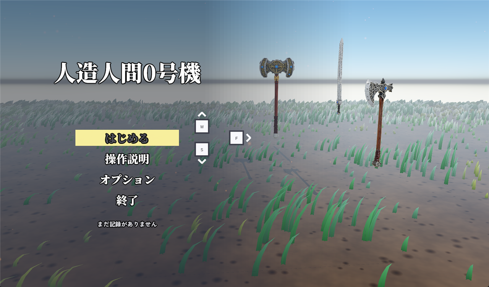
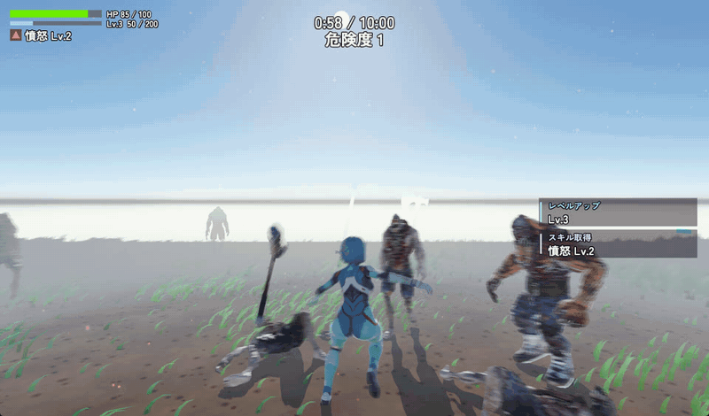
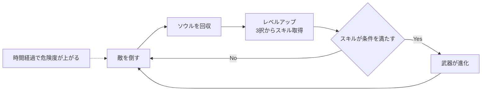
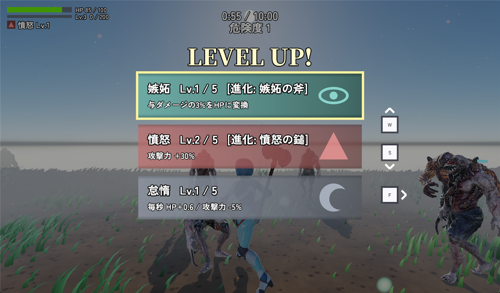
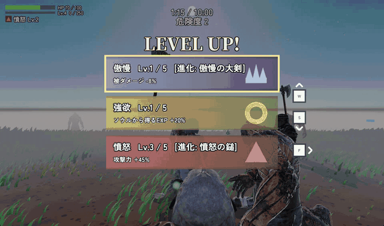
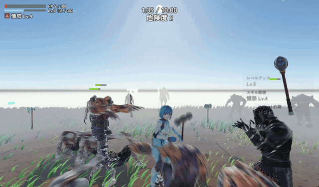
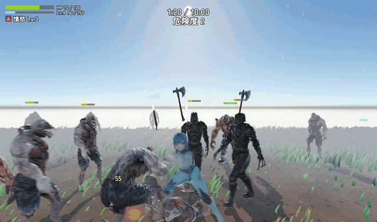
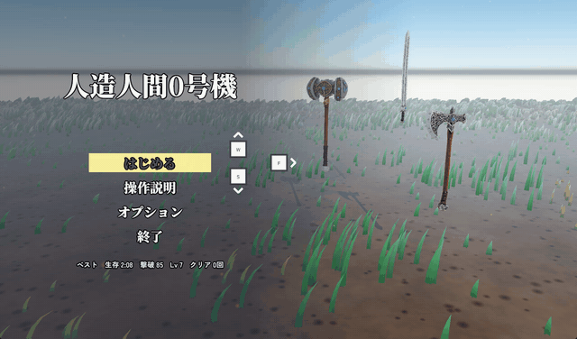

<p align="center">
  
</p>

<h1 align="center">人造人間0号機</h1>
<p align="center"><sub>CombatAndroid</sub></p>

<p align="center">
  <b>押し寄せる死者の群れを、重い武器で薙ぎ払え。</b><br>
  自作エンジンで作った、10分間を生き延びるローグライト・3Dアクション
</p>

<p align="center">
  
  
  
  
  
  <a href="https://qiita.com/tsukino_"></a>
</p>

<p align="center">
  <br>
  <sub>群れの中で戦い、ため攻撃で周囲をまとめて吹き飛ばす</sub>
</p>

人造人間となった主人公が、湧き続けるゾンビと聖騎士を相手に **10分間を生き延びる** アクションゲームです。
敵が落とすソウルで強くなり、**七つの大罪** を冠したスキルを選び、条件を満たした武器は **進化** します。
エンジンから自作し、手触り・演出・敵の群れの描画まで、1人で作り込みました。

---

## 目次

- [制作情報](#制作情報)
- [ゲーム概要](#ゲーム概要)
- [操作方法](#操作方法)
- [技術的なこだわり](#技術的なこだわり)
- [アーキテクチャ](#アーキテクチャ)
- [ビルドと実行](#ビルドと実行)
- [クレジット](#クレジット)
- [作者](#作者)

---

## 制作情報

| 項目 | 内容 |
|---|---|
| ジャンル | ローグライト・3Dアクション（サバイバー系） |
| 制作形態 | 個人制作（プログラム・ゲームデザイン・効果音生成） |
| 制作期間 | <!-- TODO: 例）2026年8月〜（約2か月） --> |
| 言語 / API | C++20 / DirectX 11 / HLSL |
| エンジン | [TsukinoEngine](https://github.com/tsukinokun/TsukinoEngine)（自作・submodule） |
| 主なライブラリ | EnTT（ECS）/ JoltPhysics / Effekseer / Assimp / DirectXTK / cereal |
| 使用ツール | <!-- TODO: 例）Visual Studio 2022 / Blender / Effekseer Tool / Mixamo --> |
| 対応環境 | Windows 10 / 11（x64） |

---

## ゲーム概要

### 1回の走行の流れ



- 走行は **10分**。時間とともに危険度ランクが上がり、敵が強く・多くなります。最後の1分は追い込みです
- 敵はフォグの外から湧き、倒すと **ソウル（EXP 玉）** を落とします
- 武器は **触れるだけで拾え**、何本でも持てます。同じ種類を拾うとレベルが上がります（Lv1〜5）

<p align="center">
  
</p>

### 武器

3種類とも「重い一撃」を軸に、役割を分けています。左クリック長押しで **3段階のため攻撃** が出せます。

| 武器 | 特徴 | 進化条件 | 進化後 |
|---|---|---|---|
| ウォーハンマー | 基礎ダメージが最も高い、一撃重視の鈍器 | 憤怒 Lv3 | **憤怒の鎚** |
| グレートソード | 基礎ダメージは控えめだが、進化するとリーチが大きく伸びる大剣 | 傲慢 Lv3 | **傲慢の大剣** |
| バトルアックス | ため攻撃で前方へ **斬撃弾** を飛ばす | 嫉妬 Lv3 | **嫉妬の斧** |

<p align="center">
  <br>
  <sub>憤怒を Lv3 にするとウォーハンマーが「憤怒の鎚」へ進化し、ため攻撃の範囲が広がる</sub>
</p>

### スキル（七つの大罪）

レベルアップのたびに3枚のカードから1つを選びます。各スキルは5段階まで重ねられます。

| スキル | 効果 |
|---|---|
| 強欲 | ソウルから得る経験値が増える |
| 暴食 | ソウルを取るとHPが回復する |
| 憤怒 | 攻撃力が上がる |
| 傲慢 | 被ダメージを軽減する |
| 嫉妬 | 与えたダメージの一部をHPに変える |
| 色欲 | 移動速度が上がる |
| 怠惰 | 常にHPが回復するが、攻撃力が下がる |

「怠惰」のように**メリットとデメリットを併せ持つ**スキルや、武器進化の条件になるスキルを混ぜ、
「どの武器を軸に、どの罪を重ねるか」というビルドの選択が生まれるようにしています。

### 敵

| 敵 | 出現 | 特徴 |
|---|---|---|
| 小ゾンビ | 開始直後 | 数で押してくる基本の敵 |
| 大ゾンビ | 30秒〜 | 硬く、一撃が重い |
| Paladin（聖騎士） | 60秒〜 | プレイヤーと同じ3種の武器を **持ち替えて** 戦う。倒すと武器を落とす |
| エリート | 危険度2〜 | 既存の敵を大きく・硬く・強くした強化個体。発光で見分けられる |

攻撃の前には **予兆（攻撃範囲の表示）** が出るので、見てから回避できます。

<p align="center">
  <br>
  <sub>黒い鎧の騎士が Paladin。プレイヤーと同じ武器を手にして迫ってくる</sub>
</p>

---

## 操作方法

| 操作 | キー |
|---|---|
| 移動 | `W` `A` `S` `D` / 矢印キー |
| ダッシュ | `Shift`（押しながら移動） |
| 回避 | `Space` |
| 攻撃（コンボ） | 左クリック |
| ため攻撃 | 左クリック長押し → 離す |
| 武器の持ち替え | マウスホイール |
| ポーズ | `Esc` |

タイトルから始めると、操作を順に案内するチュートリアルが入ります。

---

## 技術的なこだわり

### 1. ゲームエンジンから自作

描画・物理・音・アセット読み込み・ECS を持つ自作エンジン
**[TsukinoEngine](https://github.com/tsukinokun/TsukinoEngine)** の上で動いています。
エンジンとゲームは別リポジトリに分け、submodule で取り込んでいます。

- DirectX 11 を直接叩くディファードレンダラー（影・ポイントライト・フォグ・モーションブラー）
- [EnTT](https://github.com/skypjack/entt) ベースの ECS と、JSON で組み立てる **Prefab**
- [JoltPhysics](https://github.com/jrouwe/JoltPhysics) によるキャラクター制御、[Effekseer](https://effekseer.github.io/) によるエフェクト

ゲーム側は `Component`（データ）/ `System`（ロジック）/ `Utility`（共通処理）/ `Serialization`（Prefab の読み書き）を
同じ領域名で揃え、どこに何があるかを名前から辿れる構成にしています（→ [アーキテクチャ](#アーキテクチャ)）。

### 2. テーブル駆動 ― 再ビルドなしで調整できる

**課題**：アクションゲームの面白さは数値の微調整で決まる。そのたびにビルドしていては試行回数が稼げない。

**工夫**：武器・スキル・敵・湧き方・演出の調整値を、すべて [`CombatAndroid/Assets/Tables/`](CombatAndroid/Assets/Tables/) の JSON に出しました。

- 武器のダメージ・進化条件、スキルの効果量、敵の出現比重、エリートの倍率、効果音の音量……
- 各 System の演出パラメータ（ヒットストップの長さ、モーションブラーの強さ、UI の配置など）も
  `Tables/Systems/<System名>.json` へ。現在 **30 本** の System が外部化されています
- 武器や敵の種類ごとに **クラスを増やさない**。種類を足すときは enum に1つ、JSON に1項目を足すだけ
- キーが欠けていても落ちずに既定値で動き、ログに警告を出す

**結果**：ゲームを起動し直すだけで調整が反映され、バランス調整のサイクルが大幅に短くなりました。
手順は [`Assets/Tables/README.md`](CombatAndroid/Assets/Tables/README.md) にまとめています。

### 3. 手触りと演出

「重い武器で殴っている」感覚を出すために、1回のヒットに複数の演出を重ねています。

<p align="center">
  
</p>

| 演出 | 内容 | 実装 |
|---|---|---|
| ヒットストップ | 画面全体ではなく、**当たった本人と相手だけ** を一瞬止める。群れの中でも他の敵の動きは止まらない | [`HitStopComponent.hpp`](CombatAndroid/include/CombatAndroid/ECS/Component/Combat/HitStopComponent.hpp) |
| ため攻撃 | 押している長さで白→青→紫の3段階に変わり、段階ごとに威力が上がる | [`PlayerAnimationSystem.cpp`](CombatAndroid/src/ECS/System/Player/PlayerAnimationSystem.cpp) |
| 斬撃弾 | 前フレーム→今フレームを芯にしたカプセルで判定し、高速でもすり抜けない。威力は発射時に確定 | [`ProjectileComponent.hpp`](CombatAndroid/include/CombatAndroid/ECS/Component/Combat/ProjectileComponent.hpp) |
| モーションブラー | 前フレームのワールド行列・ボーン行列を退避し、オブジェクト単位で速度を出す | [`SystemPriority.hpp`](CombatAndroid/include/CombatAndroid/ECS/SystemPriority.hpp) の `MotionVectorSnapshot` |
| 攻撃予兆 | 敵の攻撃範囲を事前に地面へ表示し、「見てから避けられる」理不尽のない難しさに | `EnemyAttackTelegraphSystem` |
| 効果音 | 打撃音・ため音などを **Python で波形から生成**。数値を変えて再生成できる | [`Assets/Audio/generate_*.py`](CombatAndroid/Assets/Audio/) |

### 4. 敵AIとゲームデザイン

敵の行動はビヘイビアツリーで組んでいます。射程・速度・怯み閾値などはすべてコンポーネント側の値なので、
**小ゾンビと大ゾンビは1本のツリーを共有** しています。

```
Selector（記憶あり）
 ├─ Sequence "Death"     : 死亡していれば倒れてフェードアウト（最優先）
 ├─ Sequence "Knockback" : ノックバック・硬直中はその場で怯む
 ├─ Sequence "Attack"    : 射程内かつクールタイム明けなら攻撃
 ├─ Sequence "Chase"     : 索敵範囲内ならプレイヤーへ近づく
 └─ Action   "Idle"      : どれも成立しなければ待機
```

→ [`ZombieBehavior.cpp`](CombatAndroid/src/ECS/AI/ZombieBehavior.cpp)

- **Paladin** はプレイヤーと同じ武器を持ち替え、武器ごとに攻撃が変わる（`Assets/Prefabs/Enemy/PaladinWeaponAttacks.json`）
- **エリート** は専用の行動を持たず、生成前の設定に倍率を掛けるだけで作る。危険度テーブルと同じ仕組みに乗せ、コードを増やさない
- 危険度ランクは時計（`RunClockSystem`）から決まり、**湧き・HUD 表示が同じフレームで同じ値を読む** よう実行順を固定

### 5. 草シェーダー

<p align="center">
  
</p>

フィールド一面の草を、**草1本あたりのメモリを CPU にも GPU にも持たずに** 描いています。

- 9頂点の刃メッシュ1本をインスタンス描画で大量に並べる
- 位置・向き・高さ・揺れの位相は **セルのワールド座標のハッシュ** から毎フレーム計算。
  インスタンス番号ではなくワールド座標を種にすることで、カメラが動いても草が地面に固定される
- 板2枚のクロスビルボードで、どの角度からも地面が透けない
- 風・突風・プレイヤーのかき分け・群生（塊）・近景/遠景の LOD を頂点シェーダーで処理
- 出力を通常モデルと揃え、**既存の G-Buffer シェーダーをそのまま流用**。ライティング・影・フォグ・モーションブラーが追加実装なしで乗る

→ [`Grass.vs.hlsl`](CombatAndroid/Assets/Shaders/Grass.vs.hlsl) / [`GrassFieldSystem.cpp`](CombatAndroid/src/ECS/System/World/GrassFieldSystem.cpp)
/ 解説記事：<!-- TODO: Qiita 記事の URL --> [Qiita](https://qiita.com/tsukino_)

---

## アーキテクチャ

### 1フレームの流れ

System の実行順は [`SystemPriority.hpp`](CombatAndroid/include/CombatAndroid/ECS/SystemPriority.hpp) に集約し、
**各項目に「なぜその順番なのか」を書いています**（順番を誤ると何が1フレームずれるか、まで記述）。


### ディレクトリ構成

```
CombatAndroid/
├─ include/CombatAndroid/ ・ src/   ← 対になっている
│   ├─ ECS/
│   │   ├─ Component/<領域>/       データのみ
│   │   ├─ System/<領域>/          ロジック
│   │   ├─ Utility/<分類>/         テーブル・スポナー・判定などの共通処理
│   │   ├─ Event/<領域>/           イベント定義
│   │   ├─ Serialization/<領域>/   Prefab の読み書き
│   │   ├─ AI/                     敵のビヘイビアツリー
│   │   └─ SystemPriority.hpp      実行順とその理由
│   ├─ Scene/                      シーン構築・System 登録
│   └─ UI/                         描画の重なり順
└─ Assets/
    ├─ Tables/                     調整値（JSON）
    ├─ Prefabs/                    エンティティの初期値（JSON）
    ├─ Shaders/  Models/  Anims/  Effect/  Audio/  Textures/  Fonts/
```

領域は `Player` / `Enemy` / `Weapon` / `Combat` / `Progression` / `UI` / `Menu` / `World` / `Effect` / `Audio` / `Debug` の11個です。

---

## ビルドと実行

### 必要なもの

- Windows 10 / 11（x64）
- Visual Studio 2022（「C++ によるデスクトップ開発」ワークロード）
- Git

### 手順

エンジンを submodule で取り込んでいるため、`--recursive` を付けて clone してください。

```bash
git clone --recursive https://github.com/tsukinokun/combat-android.git
cd combat-android
```

```bash
build.bat            # Debug ビルド（初回はソリューション生成と NuGet 復元も自動で行う）
build.bat Release    # Release ビルド
run.bat              # ビルド済みの exe を起動
open.bat             # Visual Studio で開く
```

> ソースファイルを追加したときは `External\TsukinoEngine\vendor\premake5.exe vs2022` でソリューションを再生成してください。

---

## クレジット

使用している素材（モデル・アニメーション・エフェクト・フォント・BGM）の出典とライセンスは
**[CREDITS.md](CREDITS.md)** にまとめています。

---

## 作者

**山﨑 愛**

- GitHub：[@tsukinokun](https://github.com/tsukinokun)
- Qiita：[@tsukino_](https://qiita.com/tsukino_)
<!-- TODO: ポートフォリオサイト・連絡先など -->
